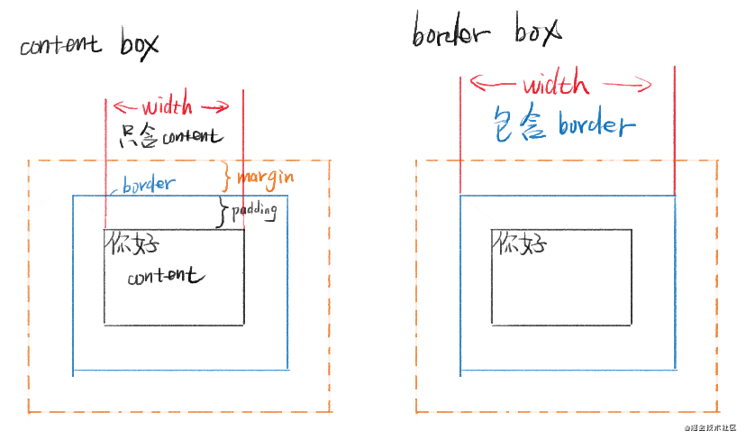
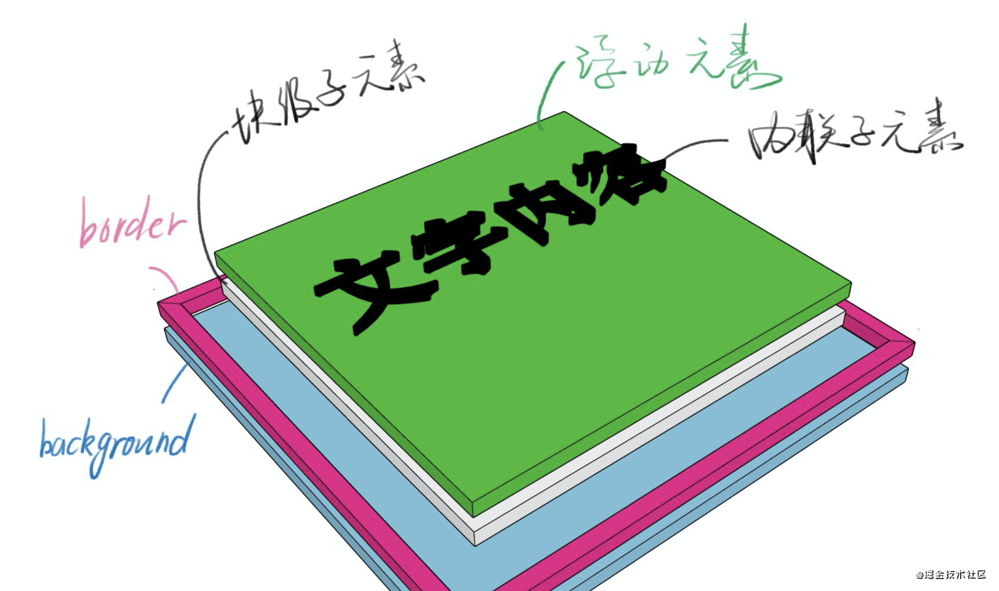
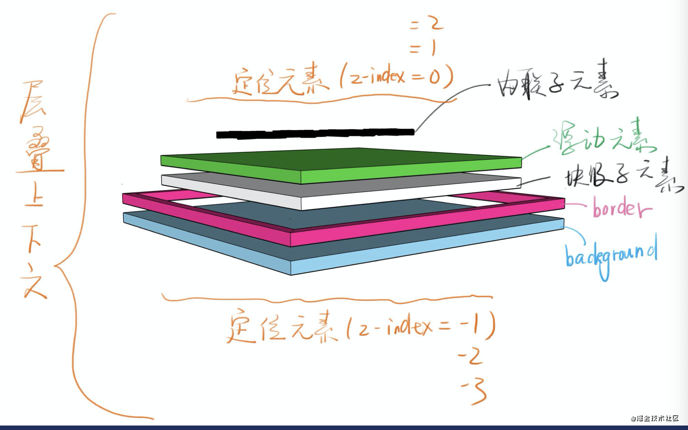

# 这是一个前端萌新的css笔记
# 一、CSS简介
全称 Cascading Style Sheets —— 层叠样式表，是一种 样式表 语言，用来描述 HTML 或 XML 文档的呈现。


层叠的几层含义：

* 样式层叠——可以多次对一个元素进行样式声明
* 选择器层叠——可以用不同选择器对同一个元素进行样式声明
* 文件层叠——可是使用多个文件对同一个元素进行样式声明

# 二、CSS语法
## 语法1
```
选择器 ｛
	属性名：属性值
  /*注释*/
｝
```
### 注意事项
* 区分大小写
* 符号要是英文
* 没有//的注释
* 最好不要省略最后的分号

## 语法2
```
@charset "UTF-8";
@import url(2.css); 
@media (min-width: 100px) and (max-width: 200px) { 
	语法一
｝
```
### 注意事项
* @charset 必须放在第一行
* 前两个at语法必须以分号结尾
* @media 语法会单独教学
* charset是字符集的意思，但UTF-8是字符编码* encoding，这是历史遗留问题，因为UTF出现之前，字符集和字符编码名称相同。

## 调试方法
* 使用 W3C 验证器（在线 / 命令行工具）——不方便
* 使用 VSCode 看颜色——没webstorm好用
* 使用 WebStorm 看颜色——打开有点慢，但是功能更强大
* 使用开发者工具看警告


## *border调试法*
怀疑某个元素有问题，就给这个元素加 border border 没出现？说明选择器错了或者语法错了 border 出现了？看看边界是否符合预期 bug 解决了才可以把 border 删掉

**常见错误**
* 选择器拼写错误
* 属性名拼写错误
* 属性值拼写错误
* 大小写错误
* 没写分号
* 中文冒号
* 没写反花括号
* 没加单位


### 资料来源
* Google 搜索关键词时加 MDN（很好用）
* CSS tricks（英文）
* 张鑫旭的博客


**注意**：标准是w3c文档。


# 三、关键知识

## 3.1文档流
Normal Flow ，文档流的知识，回答了默认情况下，页面元素是如何布局的，主要涉及到默认的宽度、高度的计算方法，换行逻辑。
### 换行逻辑
* inline 元素从左到右，到达最右边才会换行
* block 元素从上到下，每一个都另起一行
* inline-block 也是从左到右，但是不会被切断


### 宽度
* inline 宽度为内部 inline 元素的和，不能用 width 指定
* block 默认自动计算宽度，值是auto(不是100%)，默认能有多宽展示多宽，可用 width 指定
* inline-block 结合前两者特点，默认宽度就是内部元素的宽度，可用 width
### 高度
* inline 高度由 line-height 间接确定，跟padding margin无关，为什么是间接决定，因为还和字体有关（行盒）
* block 高度由内部所有文档流元素决定（脱离文档流后就包不住了），可以设 height
* inline-block 跟 block 类似，可以设置 height

### 拓展
overflow 超出部分

* visible；超出部分可见
* hidden; 超出部分隐藏
* scroll；可滚动查看（基本没人用）
* auto；不超出不显示滚动条。超出才显示滚动条。

**div中无文档流，则高度为0**


**span中无文档流也是有高度的**


## 3.2盒模型
盒模型让我们知道每个元素都有哪些看得见、或者看不见的东西“组成”，知道了组成要素，我们才能去控制他们的样式。

两种盒模型：

* content-box 内容盒 - 内容就是盒子的边界
* border-box 边框盒 - 边框才是盒子的边界

**注意**：content-box width = 内容宽度

border-box width = 内容宽度 + padding + border （用这种，一般再写css是在全局写上box-sizing = border-box;）

### **如图**


## margin合并
### 合并的情况
* 父子 margin 合并，只有上下合并，左右不合并
* -兄弟 margin 合并
  

### 阻止合并的方法
* 父子合并用 padding
* 父子合并用 overflow: hidden 挡住
* 父子合并用 display: flex，不知道为什么
* 兄弟合并是符合预期的
* 兄弟合并可以用 inline-block 消除

**注意：**CSS 的属性逐年增多，每年都可能有新的。要死记。

## 3.2布局
布局的分类：

* 固定宽度布局，一般是960 1000 1024px，多用于桌面
* 不固定宽度布局，主要靠文档流的原理来布局，多用于手机


写布局的两种思路：

* 新手建议从小到大，小布局然后组成大布局
* 老手可以从大到小，先定大局，然后完善每个小部分


### float布局
子元素上加上float：left 和width

在父元素上加 .clearfix 属性
```
.clearfix {
    content:'' ;
    display:block ;
    clear: both ;
}
```
**如果发现图片你下面有多余的部分可以在img加**
```
vertical-align: top;
vertical-align:middle;
```
### 负margin:如果做平均布局，只需要在布局中间加上一个x图层，图层多余的右边距是负的。


## flex 布局
### 首先，实现 flex 布局需要先指定一个容器，任何一个容器都可以被指定为 flex 布局，这样容器内部的元素就可以使用 flex 来进行布局。
```
.container {
    display: flex | inline-flex;       //可以有两种取值,第一种会换行，第二种不会换行
}
```
分别生成一个块状或行内的 flex 容器盒子。简单说来，如果你使用块元素如 div，你就可以使用 flex，而如果你使用行内元素，你可以使用 inline-flex。


**注意**：当设置 flex 布局之后，子元素的 float、clear、vertical-align 的属性将会失效。

### flex属性
   #### flex-direction决定主轴的方向
   ```
   .container {
    flex-direction: row | row-reverse | column | column-reverse;
}
```
1. 默认值：row，主轴为水平方向，起点在左端。
2. row-reverse：主轴为水平方向，起点在右端
3. column：主轴为垂直方向，起点在上沿
4. column-reverse：主轴为垂直方向，起点在下沿

#### flex-wrap: 决定容器内项目是否可换行
```
.container {
    flex-wrap: nowrap | wrap | wrap-reverse;
}
```
1. 默认值：nowrap 不换行，即当主轴尺寸固定时，当空间不足时，项目尺寸会随之调整而并不会挤到下一行。
2. wrap：项目主轴总尺寸超出容器时换行，第一行在上方.
3. wrap-reverse：换行，第一行在下方。

####  justify-content：定义了项目在主轴的对齐方式
```
.container {
    justify-content: flex-start | flex-end | center | space-between | space-around;
}
```
**建立在主轴为水平方向时测试，即 flex-direction: row**
1. 默认值: flex-start 左对齐
2. flex-end：右对齐
3. center：居中
4. space-between：两端对齐，项目之间的间隔相等，即剩余空间等分成间隙。
5. space-around：每个项目两侧的间隔相等，所以项目之间的间隔比项目与边缘的间隔大一倍。

#### align-items: 定义了项目在交叉轴上的对齐方式
```
.container {
    align-items: flex-start | flex-end | center | stretch;
}
```
**建立在主轴为水平方向时测试，即 flex-direction: row**
1. 默认值为 stretch 即如果项目未设置高度或者设为 auto，将占满整个容器的高度。假设容器高度设置为 100px，而项目都没有设置高度的情况下，则项目的高度也为 100px。
2. flex-start：交叉轴的起点对齐。假设容器高度设置为 100px，而项目分别为 20px, 40px, 60px, 80px, 100px
3. flex-end：交叉轴的终点对齐
4. center：交叉轴的中点对齐
   
   ####  align-content: 定义了多根轴线的对齐方式，如果项目只有一根轴线，那么该属性将不起作用
```
.container {
    align-content: flex-start | flex-end | center | space-between | space-around | stretch;
}
```
当你 flex-wrap 设置为 nowrap 的时候，容器仅存在一根轴线，因为项目不会换行，就不会产生多条轴线。

当你 flex-wrap 设置为 wrap 的时候，容器可能会出现多条轴线，这时候你就需要去设置多条轴线之间的对齐方式了。

建立在主轴为水平方向时测试，即 flex-direction: row, flex-wrap: wrap

1. 默认值为 stretch
2. flex-start：轴线全部在交叉轴上的起点对齐
3. flex-end：轴线全部在交叉轴上的终点对齐
4. center：轴线全部在交叉轴上的中间对齐
5. space-between：轴线两端对齐，之间的间隔相等，即剩余空间等分成间隙。
6. space-around：每个轴线两侧的间隔相等，所以轴线之间的间隔比轴线与边缘的间隔大一倍。


### item项目上的属性
1.  order: 定义项目在容器中的排列顺序，数值越小，排列越靠前，默认值为。

```
.item {
    order: <数字>;//可以是负数
}
```
2. flex-basis: 定义了在分配多余空间之前，项目占据的主轴空间，浏览器根据这个属性，计算主轴是否有多余空间。（控制基准宽度，默认值是auto）
```
.item {
    flex-basis: <length> | auto;
}
```
**当主轴为水平方向的时候，当设置了 flex-basis，项目的宽度设置值会失效，flex-basis 需要跟 flex-grow 和 flex-shrink 配合使用才能发挥效果 .**


3.  flex-grow: 用来分配空间。
```
.item {
    flex-grow: <数字>;
}
```
4. flex-shrink: 定义了项目的缩小比例
```
.item {
    flex-shrink: <数字>;
}
```
**默认值: 1，即如果空间不足，该项目将缩小，负值对该属性无效。**


5. align-self: 允许单个项目有与其他项目不一样的对齐方式.
```
.item {
     align-self: auto | flex-start | flex-end | center | baseline | stretch;
}
```

## grid布局
Grid 布局与 Flex 布局有一定的相似性，都可以指定容器内部多个项目的位置。但是，它们也存在重大区别。
Flex 布局是轴线布局，只能指定"项目"针对轴线的位置，可以看作是一维布局。
Grid 布局则是将容器划分成"行"和"列"，产生单元格，然后指定"项目所在"的单元格，可以看作是二维布局。
```
.container{
    display:grid|inline-grid
}
.container {
  grid-template-columns: 40px 50px auto 50px 40px;
  grid-template-rows: 25% 100px auto;
}
```
### 如图

### item可以设置范围
```
.item-a{
    grid-column-star :2;
    grid-column-end :3;//第二列开始第三列结束
    grid-row-star:3;
    grid-row-end:4;//第三列开始第四列结束
}
```
### fr单位允许您将轨道大小设置为网格容器自由空间的一部分。 例如，下面的代码会将每个 grid item 为 grid container 宽度的三分之一
```
.container {
  grid-template-columns: 1fr 1fr 1fr;
}
```


## 3.3定位


**position属性**
* static 默认值，待在文档流里
* relative 相对定位，实际位置没有变，只是眼睛看起来有点偏移，实际上没有脱离文档流
* absolute 绝对定位，定位基础是祖先里第一个非static元素。
* fixed 固定定位，定位基准是 viewport （有诈）
* sticky 粘连定位，当滚动出屏幕时，可以吸顶，兼容性较差


**注意**
1. 写了absolute一般要补一个relative
2. 写了absolute或fixed，一定要补left或top。
3. absolute 使用：脱离原来的位置，另起一层。比如对话框的关闭按钮或鼠标提示。要善用left:100%;或者left:50%;加负margin。向上可以直接用bottom：100%；
4. white-space:nowrap;文字内容不准换行。


## 3.4动画
### 浏览器的渲染过程

1. 根据HTML构建HTML树（DOM）
2. 根据CSS构建CSS树（CSSOM）
3. 将两棵树合并成一个渲染树（render tree）
4. Layout 布局（文档流、盒模型、计算大小和位置）
5. Paint 绘制（把边框颜色、文字颜色、阴影等画出来）
6. Composite   合成（根据层叠关系展示画面）

### transform 属性
* 位移 translate
* 缩放 scale
* 旋转 rotate
* 倾斜 skew


**注意**
1. inline元素不支持transform，需要先换成block
```
translate(50%,50%)
left:50%;
top:50%;//用来做绝对定位元素的居中。
```
### transition属性
transition：属性名 时长 过渡方式（linear匀速 ease-in先慢后快 ease-out淡出 ease-in-out 淡入） 延迟（多久后开始动画）

**不是所有属性都可以过度**


display:none=>block无法过度

一般改成visibility:hidden=>visible

颜色可以过度


opacity 透明度可以过度


## animation 属性
```
animation-name: none//属性名
animation-duration: 0s//时长
animation-timing-function: //过渡方式
animation-delay: 0s//延时
animation-iteration-count: 1//次数
animation-direction: normal//方向(reverse,alternate,alternate-reverse)
animation-fill-mode: none//填充模式（none,forwards,backwards,both）
animation-play-state: (running,paused)
```
# 遇到不会的直接去mdn查，css就是要多查，多记，多用。


